# Security Policy

### Red Hat Enterprise Security Incident Response

```mermaid
graph TD
    A["🚨 Vulnerability Discovered"] --> B["📧 Private Report<br/>to Maintainers"]
    B --> C["🔐 Triage & Assessment<br/>CVE Evaluation"]
    C --> D["🛠️ Patch Development<br/>Internal Testing"]
    D --> E{"Ready?"}
    E -->|Yes| F["📢 Coordinated Disclosure<br/>Credit"]
    E -->|No| G["🔄 Iterate<br/>Testing"]
    G --> D
    F --> H["🎯 Public Advisory<br/>Patch Release"]
    style A fill:#c41c3b,stroke:#262626,color:#fff,stroke-width:2px
    style B fill:#e74c3c,stroke:#262626,color:#fff
    style C fill:#e67e22,stroke:#262626,color:#fff
    style D fill:#f39c12,stroke:#262626,color:#fff
    style E fill:#e74c3c,stroke:#262626,color:#fff
    style F fill:#27ae60,stroke:#262626,color:#fff
    style H fill:#27ae60,stroke:#262626,color:#fff
```

If you discover a security vulnerability in this project, please report it privately to the maintainers listed in the `MAINTAINERS` file. Do not disclose the issue publicly until it has been addressed.

Recommended process:

1. Email the maintainers with: subject `K.A.O.S. Security Report` and include a short description, reproduction steps, and any PoC if available.
2. Allow maintainers reasonable time to respond and remediate.
3. We will coordinate disclosure and credit where appropriate.

For urgent security issues you can also use GitHub's private security advisories.
