## Contributing to K.A.O.S.

### Red Hat Enterprise DevSecOps Standard

```mermaid
graph LR
    A["📝 Pull Request"] --> B["🔍 Code Review<br/>Security Check"]
    B --> C["✅ CI/CD Pipeline<br/>Lint + Test"]
    C --> D{"✔️ Approved?"}
    D -->|Yes| E["🚀 Merge to Main"]
    D -->|No| F["💬 Request Changes"]
    F --> A
    style A fill:#c41c3b,stroke:#262626,color:#fff
    style B fill:#e74c3c,stroke:#262626,color:#fff
    style C fill:#27ae60,stroke:#262626,color:#fff
    style D fill:#f39c12,stroke:#262626,color:#fff
    style E fill:#27ae60,stroke:#262626,color:#fff
    style F fill:#e74c3c,stroke:#262626,color:#fff
```



Thank you for considering contributing to K.A.O.S. We welcome contributions that improve the project, documentation, tests or deployment.

Guidelines

- Fork the repository and create topic branches for your changes.
- Write clear, focused commits. Use conventional commit messages when possible.
- Sign your commits with `git commit -s` to add a Developer Certificate of Origin (DCO) sign-off.
- Run existing tests and add new tests for new features or bug fixes.
- Ensure code passes `flake8` (or configured linter) and unit tests before opening a PR.

Submitting a PR

- Open a Pull Request against `main` describing the change and the reasoning.
- Link any relevant issue numbers and provide testing/QA steps.
- One or more maintainers will review; be responsive to review requests.

Development environment

To run tests and linters locally:

```bash
python -m pip install -U pip
python -m pip install -r K.A.O.S._BACKEND/src/brain/requirements.txt || true
pip install -r K.A.O.S._FRONTEND/src/kaos_arm/requirements.txt || true
pip install flake8 pytest || true
flake8 . || true
pytest -q || true
```

If you need help, open an issue or contact a maintainer listed in the `MAINTAINERS` file.
