# K.A.O.S. Brain - Cognitive Backend (Enterprise)

## Architecture

```mermaid
graph LR
    subgraph "🖥️ Frontend Layer"
        A["🛡️ Kali Client<br/>Agent"]
    end
    subgraph "🧠 Cognitive Backend"
        B["🔗 Flask/Gunicorn<br/>HTTP API"]
        C["⚡ Hybrid Engine<br/>Regex + Risk"]
        D["🧬 Ollama LLM<br/>Mistral/Llama"]
    end
    subgraph "📊 Analysis Stack"
        E["📈 Decision Engine<br/>Fast-Path"]
        F["🔍 Deep Reasoning<br/>Threats"]
    end
    A -->|JSON| B
    B --> C
    C --> E
    C --> D
    D --> F
    style A fill:#c41c3b,stroke:#262626,color:#fff
    style B fill:#e74c3c,stroke:#262626,color:#fff
    style C fill:#e74c3c,stroke:#262626,color:#fff
    style D fill:#9b59b6,stroke:#262626,color:#fff
    style E fill:#27ae60,stroke:#262626,color:#fff
    style F fill:#3498db,stroke:#262626,color:#fff
```



## Overview
The K.A.O.S. Brain is the central cognitive processing unit for the security operations platform. It utilizes a hybrid approach combining deterministic regex heuristics for fast-path analysis and Large Language Models (LLM) for deep reasoning.

## Deployment

This repository utilizes an atomic Ansible deployment strategy with Systemd integration and automatic rollback capabilities.

### Prerequisites
- Ansible installed on control node.
- Target host accessible via SSH (or localhost).

### Run Deployment
Execute the following command from the project root:

```bash
ansible-playbook ops/ansible/deploy_brain.yml
```

## Features
- **Tenacity**: Robust retry logic for LLM connections.
- **Orjson**: High-performance JSON serialization.
- **Safety**: Pre-flight checks for destructive commands.
