# K.A.O.S. (Ai-Kali-RHEL) - Ubuntu Deployment Edition

    

    
    &nbsp;&nbsp;
    
    &nbsp;&nbsp;
    

**Note:** This project is under active development.

---

## Technologies Used

- Container runtime: Podman (rootless)
- OS: Red Hat Enterprise Linux (RHEL 8/9), Ubuntu (for dev/testing)
- Backend: Flask + Gunicorn + Gevent
- Serialization: orjson
- Retry/Resilience: Tenacity
- NLP/LLM: Ollama / Mistral / Llama
- CI/CD: GitHub Actions (lint + tests)
- Deployment: Ansible (atomic deploy, symlink rotation)
- Languages: Python 3.10+
- Security: SubUID/SubGID, CAP_NET_RAW (controlled), host-mounted audit volumes

---

  

Enterprise-grade Offensive AI Framework for RHEL-compatible environments.

Hybrid Offensive AI Framework for Enterprise Linux Environments.

## Technical Architecture

```mermaid
graph TB
    subgraph "🏢 Enterprise Layer"
        A["🛡️ Ansible<br/>Orchestration"]
    end
    subgraph "🧠 AI/ML Layer"
        B["⚡ Gunicorn/Gevent<br/>Backend"]
        C["🔄 Hybrid Engine<br/>Fast-Path + LLM"]
    end
    subgraph "💾 Persistence & State"
        D["📁 Symlink<br/>Config Mgmt"]
        E["🔐 State<br/>Retention"]
    end
    subgraph "🔍 Intelligence Tiers"
        F["⚙️ Heuristic<br/>Fast-Path"]
        G["🧬 Deep Learning<br/>Analysis"]
    end
    A --> B
    B --> C
    C --> F
    C --> G
    B --> D
    D --> E
    style A fill:#c41c3b,stroke:#262626,color:#fff
    style B fill:#e74c3c,stroke:#262626,color:#fff
    style C fill:#e74c3c,stroke:#262626,color:#fff
    style D fill:#d35400,stroke:#262626,color:#fff
    style E fill:#d35400,stroke:#262626,color:#fff
    style F fill:#27ae60,stroke:#262626,color:#fff
    style G fill:#3498db,stroke:#262626,color:#fff
```

### High-Performance Backend (Gunicorn/Gevent)
Engineered for high-concurrency environments, the backend utilizes Gunicorn with Gevent workers to ensure non-blocking I/O operations, critical for real-time AI processing.

### Persistence Strategy (Symlinking)
Adopts a robust symlink-based architecture for configuration management and data persistence, ensuring seamless upgrades and state retention across container lifecycles.

### Enterprise Orchestration (Ansible Atomic Deploy)
Deployment logic is encapsulated in Ansible playbooks designed for atomicity. This guarantees that infrastructure changes are either fully applied or rolled back, preventing inconsistent states.

### Hybrid Intelligence (Fast-Path logic)
Features a tiered decision engine capable of executing rapid heuristic evaluations (Fast-Path) for immediate threats, while offloading complex analysis to deep learning models.
